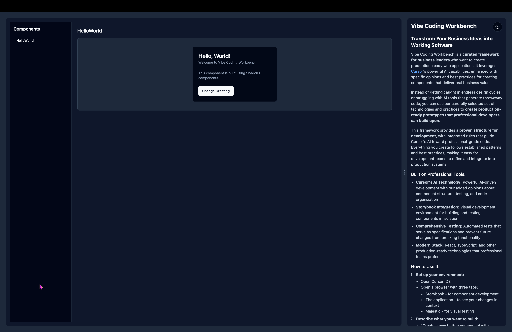

# Vibe Coding Workbench: A Professional Web Development Framework for Cursor

## Transform Ideas into Production-Ready Prototypes

**Vibe Coding Workbench** is a curated development framework that helps you build production-ready web applications using [Cursor](https://cursor.sh)'s powerful AI capabilities. While tools like Claude Artifacts, v0.dev, and Bolt.new offer AI-driven development, Vibe Coding Workbench takes a different approach: it provides a carefully selected set of technologies, opinions, and best practices for using Cursor to create web components that deliver real business value and can be seamlessly integrated into production applications.

For a detailed exploration of the philosophy and methodology behind Vibe Coding, read [The Vibe Coding Client](https://anth.us/blog/vibe-coding-client/).

## Watch Vibe Coding Workbench in Action

Check out our [demo video on YouTube](https://www.youtube.com/watch?v=Qw2807PSZ5I) to see Vibe Coding Workbench in action. This demonstration shows how business users can collaborate with AI to build professional web components quickly and efficiently.

[](https://www.youtube.com/watch?v=Qw2807PSZ5I)

### Built on Cursor's AI Technology

This project doesn't provide new AI technology - instead, it leverages Cursor's existing AI capabilities and enhances them with:

- **Curated Best Practices**: Integrated rules that guide Cursor's AI toward professional-grade code
- **Development Workflow**: A proven structure for creating, testing, and sharing components
- **Technology Stack**: Carefully selected tools that work together seamlessly:
  - **Storybook**: For component development and documentation
  - **Comprehensive Testing**: Jest and Storybook interaction tests
  - **Modern Web Stack**: React, TypeScript, and other production-ready technologies
  - **Developer Handoff**: Clean, well-structured code that professional teams can build upon

### What Makes It Special

- **Opinionated Framework**: While Cursor's AI is powerful, this framework adds specific opinions about:
  - How to structure components for maximum reusability
  - When and how to write tests
  - Best practices for code organization
  - Patterns for business-developer collaboration
- **Production Focus**: Everything is built with real-world deployment in mind:
  - Components are properly isolated and tested
  - Code follows established patterns
  - Documentation is business-friendly
  - Changes are easy to track and share

### Perfect for Business Leaders

Traditional development is slow and expensive because there's a gap between business ideas and technical implementation. Vibe Coding Workbench bridges this gap:

1. **Rapid Prototyping**: Create working features in hours instead of weeks
2. **Visual Feedback**: See your changes instantly in both Storybook and the running app
3. **Quality Built-In**: Automated tests and type checking prevent common problems
4. **Smooth Handoff**: Developers get clean, well-structured code they can immediately build upon
5. **Professional Foundation**: Built on the same tools and practices used in production systems

When you've created something valuable and need help taking it to production, [Anthus AI Solutions](https://anth.us) provides the expertise to deploy and operate your application with enterprise-level sophistication.




### For Business Leaders: Why This Matters to You

Traditional app development is slow and frustrating:
1. **Endless design cycles**: Weeks spent on mockups that still don't capture your vision
2. **Communication barriers**: Difficulty explaining your ideas to technical teams
3. **Long development timelines**: Months of waiting before seeing anything functional
4. **Costly changes**: Minor adjustments requiring significant rework
5. **Risk of project failure**: Discovering major issues only after significant investment

**Vibe Coding Workbench changes everything** by allowing you to:

- **Create functional prototypes immediately** - See and interact with real components, not just static designs
- **Communicate precisely with developers** - Show exactly what you want instead of trying to explain it
- **Validate ideas quickly** - Test concepts with real users before committing resources
- **Reduce development costs** - Provide developers with working examples that clarify requirements
- **Minimize project risks** - Identify and solve problems early when changes are easy and inexpensive

## How It Works: Your Development Environment

The Vibe Coding Workbench workflow uses two main tools:

1. **Cursor**: An AI-powered code editor where you describe what you want to build
2. **Browser**: Running three tabs:
   - **Storybook**: Shows individual components you're building
   - **Application**: Shows how everything works together
   - **Test Runner**: Verifies everything works correctly


### The Business User's Workflow

1. **Describe what you want** to the AI in Cursor
2. **See it built in real-time** in the Storybook browser tab
3. **Test it immediately** to verify it works as expected
4. **Make adjustments** by telling the AI what to change
5. **Verify nothing broke** with automated tests
6. **Repeat** with small, incremental improvements

This approach is called "vibe coding" - you focus on communicating the vibe or feel of what you want, and the AI handles the technical implementation.

## Getting Started: Setting Up Your Environment

### Step 1: Install Cursor

1. Download and install [Cursor](https://www.cursor.com/en) from the official website
2. Open Cursor after installation

### Step 2: Set Up Your Project

1. Clone the repository (or ask a developer to help you with this step):
   ```
   git clone <repository-url>
   cd cursor-storybook
   ```

2. Install dependencies (or ask a developer to help you with this step):
   ```
   npm install
   ```

### Step 3: Start Your Development Environment

Open three terminal windows in Cursor (using the Terminal menu or Ctrl+` shortcut):

1. In the first terminal, start Storybook:
   ```
   npm run storybook
   ```
   This will open Storybook in your browser at http://localhost:6006

2. In the second terminal, start the application:
   ```
   npm start
   ```
   This will open the application in your browser at http://localhost:3000

3. In the third terminal, start the test runner:
   ```
   npm run test:ui
   ```
   This will open Majestic (the visual test runner) in your browser at http://localhost:4000

If you prefer to run tests directly from the command line instead of using the visual interface:
```
npm test
```

### Step 4: Arrange Your Windows

For the best experience, arrange your windows like this:
1. **Cursor Editor**: Where you'll describe what you want to build to the AI
2. **Browser - First Tab**: Storybook showing individual components
3. **Browser - Second Tab**: The full application showing how components work together
4. **Browser - Third Tab**: Majestic test interface showing test results

## Working with the AI Assistant

The key to success with Vibe Coding Workbench is effectively communicating with the AI assistant. Here's how to get the best results:

### How to Talk to the AI

1. **Be specific about what you want**: "Create a contact form with fields for name, email, and message"
2. **Describe the look and feel**: "Make the submit button blue and rounded with a subtle hover effect"
3. **Explain the behavior**: "When the form is submitted, show a success message and clear the form"
4. **Reference existing components**: "Use the same card style as on the homepage"
5. **Ask for changes**: "Can you make the text larger and add more space between the fields?"

### Example Conversations

#### Creating a New Component

```
You: I need a feedback form with fields for name, email, rating (1-5 stars), and comments.

AI: I'll create a feedback form component for you. Let me set up the files...

[AI creates the component files]

You: Can you make the star rating interactive so users can click on stars?

AI: Sure, I'll update the component to include an interactive star rating...

[AI updates the component]

You: Let's add some validation to make sure the email is valid.

AI: I'll add email validation and error messages...

[AI adds validation]

You: Now let's add tests to make sure the validation works correctly.

AI: I'll create tests for the email validation...

[AI adds tests]
```

#### Modifying an Existing Component

```
You: The buttons on the dashboard are too small. Can we make them larger?

AI: I'll increase the size of the dashboard buttons...

[AI updates the component]

You: The blue color doesn't match our brand. Can we change it to #3366CC?

AI: I'll update the button color to match your brand...

[AI updates the component]

You: Let's also add an icon to the left of the text in each button.

AI: I'll add icons to the buttons...

[AI updates the component]
```

#### Sharing Your Work with Developers

```
You: I want to start working on a new feature for the dashboard. How do I create a new branch?

AI: I'll help you create a new branch for the dashboard feature...

[AI creates a new branch with a descriptive name like "feature/dashboard-improvements"]

You: How can I check what branch I'm currently working on?

AI: I'll show you your current branch and available branches...

[AI shows Git status and branch information]

You: I've made some changes to the dashboard. How do I save them to share with the developers?

AI: I'll help you commit your changes with a clear message...

[AI stages and commits the changes with a descriptive message]

You: Now I want to share these changes on GitHub. How do I do that?

AI: I'll help you push your changes to GitHub...

[AI pushes the changes to the remote repository]

You: I need to switch back to the main branch to start something else. How do I do that?

AI: I'll help you switch branches, but first let's make sure your changes are saved...

[AI checks for unsaved changes and helps switch branches]
```

## Understanding What You're Looking At

### Storybook: Your Component Library

**Storybook** is where you see individual components in isolation. Think of it as a catalog of all the building blocks available for your application.

In Storybook, you can:
- See each component on its own
- Try different variations of a component
- Interact with components to test their behavior
- Read documentation about how to use each component

### The Application: Your Complete Product

**The Application** is the full product that combines all components together. This is what your users will eventually see.

The application shows:
- How components work together
- The complete user experience
- The actual functionality of your product

### Majestic: Your Quality Assurance Tool

**Majestic** is a visual interface for running tests. It helps ensure that everything works correctly.


With Majestic, you can:
- Run all tests with one click
- See which tests pass (green) and fail (red)
- Get detailed information about any problems
- Ensure changes don't break existing functionality

## Design Resources

When describing what you want to the AI, these resources can help you communicate more effectively:

### UI Components

Browse [Shadcn UI Components](https://ui.shadcn.com/docs/components/accordion) to see the types of components available. You can tell the AI: "Create a component like the Accordion on the Shadcn UI site."

### Colors

Reference the [Tailwind Color Palette](https://tailwindcss.com/docs/colors) when discussing colors. For example: "Use sky-500 for the button background."

### Icons

Browse the [Lucide Icon Library](https://lucide.dev/icons/) to find icons for your components. You can tell the AI: "Add a mail icon from the Lucide library to the contact button."

## Tips for Success

1. **Start small**: Begin with simple components and gradually add complexity
2. **Make incremental changes**: Small, focused changes are easier to implement and test
3. **Verify each change**: Check that each modification works before moving on
4. **Use specific terminology**: Reference component names, colors, and icons from the resources above
5. **Ask for tests**: Ensure new features work correctly by requesting tests
6. **Commit frequently**: Save your progress regularly to avoid losing work

## Need Help?

Vibe Coding is designed to empower developers, not replace them. When you've created a valuable prototype and are ready to take it to the next level, [Anthus AI Solutions](https://anth.us) can help bridge the gap between prototype and production.

With decades of experience in enterprise-level application development and operations, we bring expertise in:

- **Seamless developer collaboration** - We work with your existing development team to help them build on your prototype
- **Enterprise-grade deployment** - Secure, scalable hosting with serverless architecture that grows with your needs
- **Regulatory compliance** - Experience with HIPAA, SOC2, and other compliance frameworks for regulated industries
- **Operational excellence** - 24/7 monitoring, maintenance, and support for mission-critical applications
- **AI integration expertise** - Strategic implementation of AI capabilities that deliver measurable business value

### Contact Us

- **Website**: [https://anth.us](https://anth.us)
- **Email**: Contact us through our website
- **Services**: AI Solutions, Serverless Software, Conversational AI Agents

Remember, the goal is to create a functional prototype that demonstrates your vision. When you're ready to transform that prototype into a production-ready application, we're here to help you navigate that journey successfully.

## Sharing Your Work with Developers

One of the most powerful features of Vibe Coding Workbench is how easily you can share your work with developers. You don't need to understand Git's technical details - you can use simple English commands to manage your work.

### Working with Features

Each new feature or set of changes should be worked on in its own branch. Think of branches like separate workspaces where you can experiment without affecting the main project.

#### Creating a New Feature Branch
Simply tell the AI what you want to work on:
- "I want to create a new branch for updating the dashboard design"
- "I need to start working on a new feature for user profiles"
- "Let's create a branch for the new feedback form"

The AI will create a properly named branch and switch to it automatically.

#### Checking Your Current Work Area
If you're unsure which branch you're working on:
- "What branch am I currently on?"
- "Show me my current branch"
- "List all available branches"

The AI will show you your current branch and can list all branches if needed.

### Saving and Sharing Your Work

#### Saving Changes (Committing)
When you've made changes you want to save:
- "Save my changes with a message explaining what I did"
- "Commit these updates to the dashboard"
- "Save my work on the feedback form"

The AI will help you create a clear commit message that developers will understand.

#### Sharing on GitHub (Pushing)
When you're ready to share your work with developers:
- "Share my changes on GitHub"
- "Push my updates to the remote repository"
- "Sync my changes with the team"

The AI will ensure your work is properly synced to GitHub where developers can review it.

### Best Practices for Sharing

1. **Work in Features**: Always create a new branch for each feature or set of changes
2. **Save Frequently**: Commit your changes regularly with clear messages about what you did
3. **Share Early**: Push your work to GitHub frequently so developers can see your progress
4. **Keep Notes**: Use commit messages to document your decisions and requirements
5. **Ask for Help**: If you're unsure about any Git operations, just ask the AI for guidance

### Common Scenarios

1. **Starting New Work**
   ```
   You: "I need to start working on a new navigation menu"
   AI: "I'll create a new branch called 'feature/navigation-menu' and switch to it"
   ```

2. **Saving Progress**
   ```
   You: "I've updated the colors and layout, can we save these changes?"
   AI: "I'll commit your changes with a message describing the updates"
   ```

3. **Sharing with the Team**
   ```
   You: "I want to share my navigation menu changes with the developers"
   AI: "I'll push your changes to GitHub so the team can see them"
   ```

4. **Switching Tasks**
   ```
   You: "I need to work on something else now"
   AI: "Let's make sure your current changes are saved, then switch branches"
   ```

Remember, you don't need to memorize Git commands or understand the technical details. Just tell the AI what you want to do in plain English, and it will help you manage your work professionally. 